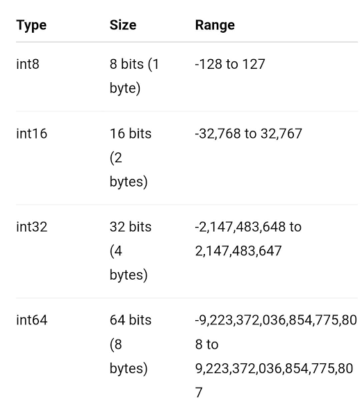
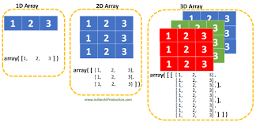
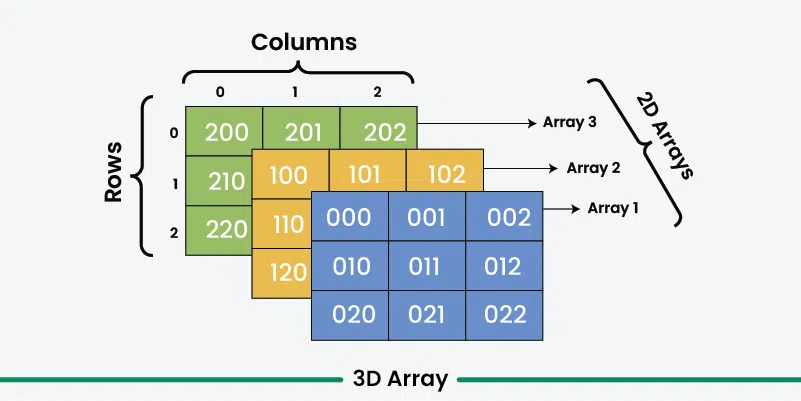
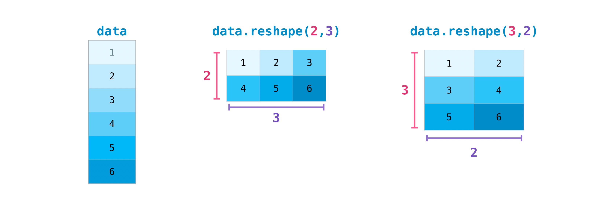

# NUMPY

**Numpy** (_Numerical Python_) adalah library python yang berfungsi untuk mengolah angka dan matriks matematika dengan cepat.

Cara menginstal Numpy:

1. Di terminal:

```
pip install numpy
```

2. Lalu import ke IDE dan harus berada di file python

```
import numpy as np
```

_as np adalah singkatan yang biasanya digunakan_

## 1. dtype (Data Type)

```
print(array.dtype)
```

Sebuah label yang digunakan oleh **Numpy** untuk menentukan jenis data.

**Semua elemen di dalam satu array Numpy harus memiliki dtype yang sama**

## Jenis jenis dtype dasar :

1. int64/int32/int16/int8 = Angka bulat tanpa desimal (10, 50, -100)

2. float64/float32/float16/float8 = Angka desimal (3.14, 0.5, 99,9)

3. bool = Boolean 0 / 1 (True / False)

4. U# = Unicode/String = Teks biasa (abcd, lmnop)

5. Object = Campuran

_Dengan Mengatur dtype yang pas, kita menghemat RAM saat mengolah data, sehingga lebih efisien dan lebih baik untuk performa dan kecepatannya_



Tiap Data Types mempunyai minimal dan maksimal atau kapasitasnya sendiri, Tabel diatas adalah angka pastinya.

**astype()** adalah fungsi bawaan Numpy untuk mengubah dtype dari luar

# 2. Multidimensional Arrays

adalah array Numpy yang datanya memiliki baris dan kolom.



## Tingkatan dimensi :

1. 0 dimensi
2. 1 dimensi
3. 2 dimensi
4. 3 dimensi

Disini saya akan fokus menjelaskan 3 dimensi saja.

## .ndim (Number of Dimension)

```
array.ndim
```

adalah perintah Numpy yang digunakan untuk mengecek ada berapa total dimensi yang menyusun array.

Contoh:

```
array = np.array("A")

print(array.ndim)

Output :
0
```

Jumlah dimensi dari array tersebut adalah 0

## .shape

Digunakan untuk melihat ukuran atau kapasitas array.

```
array.shape
```

Output yang diberikan adalah **Tuple**. Biasanya seperti :

```
(Jumlah Layer, Jumlah Baris, Jumlah Kolom)
```



## .reshape()

Digunakan untuk mengatur ulang atau mengubah bentuk struktur dimensi suatu array.

```
array = array.reshape()
```



**Total perkalian dimensi harus sama dengan jumlah data asli.**

Jadi anda bisa mengubah bentuk data yang ada dengan menggunakan fungsi ini, dan ada keunikan dari fungsi ini yaitu menggunakan -1. contohnya:

```
array = np.array([1,2,3,4,5,6,7,8,9,10,11,12])

array = array.reshape(-1, 2)

print(array)
```

Jadi di dalam kode itu ada -1 yang berfungsi sebagai otomatisasi di fungsi ini, misal kita mempunyai ribuan data dan ingin membentuk struktur 2 dimensi yang rapi tanpa perlu menghitung jumlah barisnya secara manual, kita cukup menentukan jumlah kolom yang pasti, lalu tinggal pasang -1 di bagian jumlah baris, Numpy akan otomatis membagi total data tersebut.

Contoh output :
```
[[ 1  2]
 [ 3  4]
 [ 5  6] 
 [ 7  8]
 [ 9 10]
 [11 12]]
```


